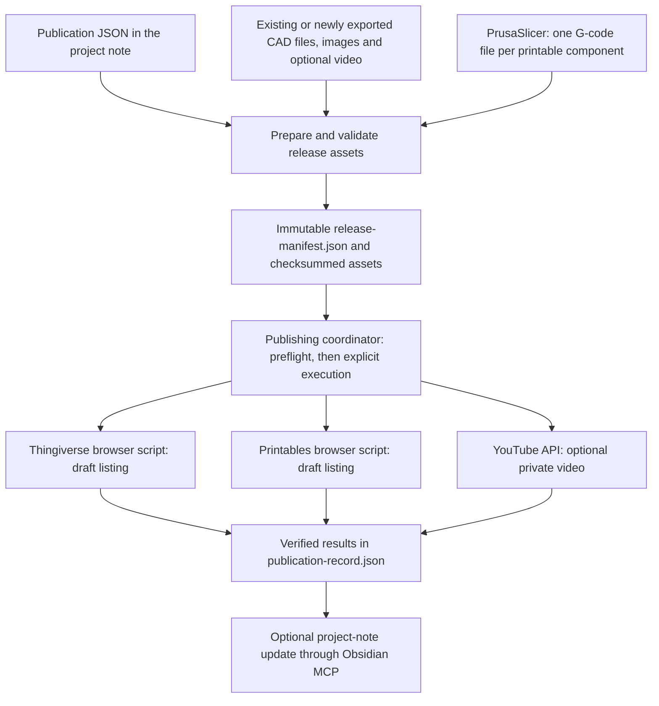
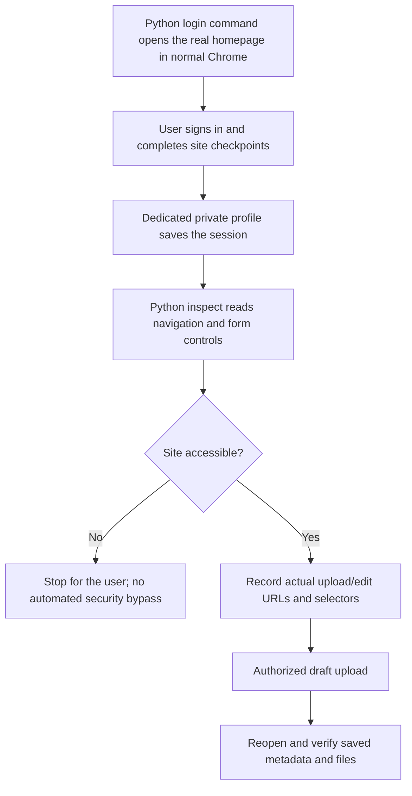
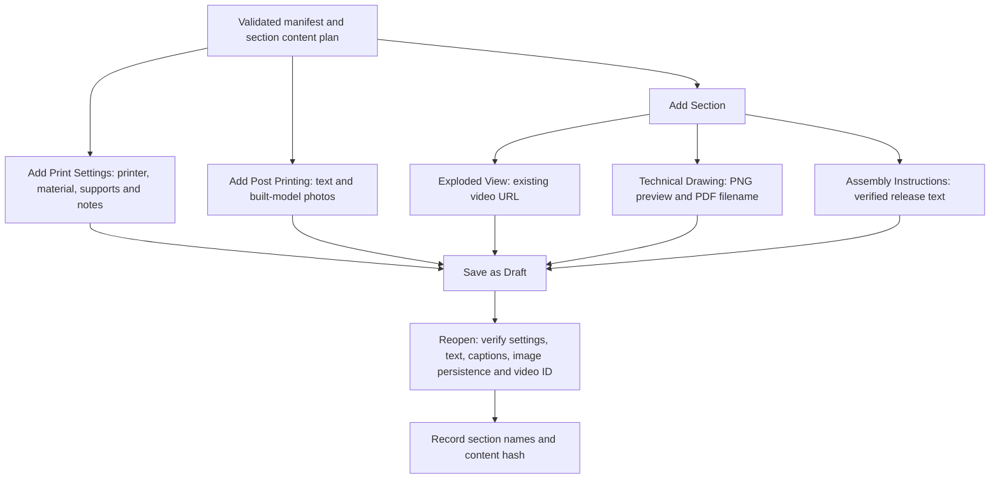
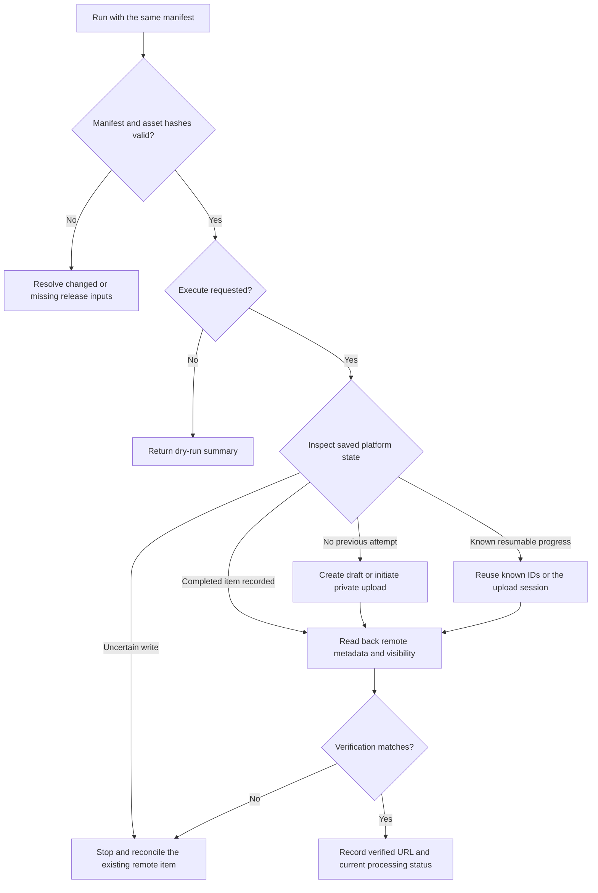

# CAD Publishing Skills

Reusable skills and `uv`-managed Python scripts for preparing a 3D-model release, creating Thingiverse and Printables drafts, and uploading an optional private YouTube video.

The aim is to reduce repeated agent context and computer-use interactions: validate one release manifest, run deterministic scripts, and return compact results. Routine publishing does not require screenshots or model-directed clicking. Thingiverse and Printables use browsers controlled by Python through reusable editor maps.

## Skills

| Skill | Responsibility | Implementation |
| --- | --- | --- |
| [prepare-3d-model-release](prepare-3d-model-release/SKILL.md) | Prepare assets, listing copy and an immutable release manifest | Python validation; Fusion exporter and PrusaSlicer when preparation is needed |
| [publish-3d-model-release](publish-3d-model-release/SKILL.md) | Preflight and coordinate the selected publishers | Python subprocesses in separate locked `uv` environments |
| [publish-thingiverse](publish-thingiverse/SKILL.md) | Create or verify drafts and update native print/assembly sections, files, images and tags | Python Playwright; no Thingiverse API tokens |
| [publish-printables](publish-printables/SKILL.md) | Create and verify a draft, including Printables-only G-code | Python Patchright with an inspected editor map |
| [publish-youtube](publish-youtube/SKILL.md) | Upload or resume a private video and verify its metadata | YouTube Data API with OAuth and resumable transfer |

Keep the sibling directories together: the platform scripts share validation and state helpers from `publish-3d-model-release`. Each skill has its own `SKILL.md`, `pyproject.toml` and `uv.lock`.

## End-to-end flow



The branches show responsibility, not parallel execution: the coordinator runs selected platforms sequentially. G-code goes only to Printables; model files, galleries and metadata go to the model platforms, and the video goes to YouTube. The publishers do not export CAD, slice models, start printers or write to Obsidian.

Already have a valid release manifest and its assets? Skip preparation and start with the publishing preflight. There is no need to reopen Fusion 360. If only the exported files exist, use the preparation workflow to validate and package them first.

## Requirements and setup

- `uv` and Python 3.11 or newer. Run the commands below from the repository root.
- A macOS or Linux environment; the shared state locking uses POSIX `fcntl`.
- A prepared release folder and `release-manifest.json`.
- Account authorization for each platform being used.
- Google Chrome for normal sign-in and the Thingiverse/Printables scripts. Optional Chromium needs the corresponding browser installation (Patchright for Printables, Playwright for Thingiverse).

Synchronize the projects you need. There is no root Python project or combined virtual environment.

```bash
uv sync --locked --project publish-3d-model-release
uv sync --locked --project publish-thingiverse
uv sync --locked --project publish-printables
uv sync --locked --project publish-youtube
uv run --locked --project publish-printables patchright install chromium
```

For preparation, also run `uv sync --locked --project prepare-3d-model-release`. Fusion's CAD Exporter and PrusaSlicer are preparation tools, not dependencies of the upload scripts.

### Account setup

| Platform | Required setup | Details |
| --- | --- | --- |
| Thingiverse | A dedicated signed-in Chrome profile, observed editor map and confirmed category | [Login and browser setup](publish-thingiverse/references/browser.md) |
| Printables | A dedicated signed-in browser profile and a map of the current editor controls | [Login, inspection and map schema](publish-printables/references/browser.md) |
| YouTube | A Google OAuth Desktop client, enabled YouTube Data API and user consent | [OAuth, scopes and resumable sessions](publish-youtube/references/oauth.md) |

Store credentials, browser profiles and sensitive upload-session files outside the repository, release folder and Obsidian vault. Do not paste their contents into chat. Login and security checkpoints remain user actions. Thingiverse's upload terms can be accepted with the direct CLI's `--accept-upload-terms` only after explicit authorization for that draft; the flag does not cover other consent or security checks.

Thingiverse has a live-tested [Bathroom / CC-BY-4.0 editor map](publish-thingiverse/references/bathroom-cc-by-map.json). Reuse it for matching releases; inspect and adapt it for another category, licence or changed site. Printables still needs a working signed-in editor inspection. The local HTML fixtures are only tests, never login or upload pages.

Live status on 10 September 2026: the authorized Thingiverse test draft was saved and reopened with 12 source assets, 10 tags and all five native sections. Printables remains blocked by an HTTP 403/security checkpoint that the user could not complete in the script browser; no Printables test upload was verified. Do not add security-bypass settings or repeat the same failed login loop.

### Browser connection flow



The browser setup references contain the login/inspect commands. Login starts at each site's homepage, not an assumed editor URL. `inspect --pause` keeps a visible browser open for the user to resolve a checkpoint before the script reads the page. Neither login completion nor a passing fixture test proves an upload works.

## Quick start

All `/absolute/...` paths below are placeholders. Replace them with your own paths, keeping quotes around paths containing spaces.

### 1. Prepare a release, if needed

Follow the [preparation skill](prepare-3d-model-release/SKILL.md) and complete the [Publication JSON template](prepare-3d-model-release/assets/publication-template.md). The current preparation CLI reads `--note`; it does not accept a standalone `--spec` input.

```bash
uv run --locked --project prepare-3d-model-release \
  prepare-3d-model-release/scripts/build_release.py \
  --note "/absolute/project-note.md"
```

The command validates files already present in the declared release folder; it does not itself run Fusion or PrusaSlicer. It writes `release-manifest.json`, `listing-copy.md` and `release-summary.md`. The manifest records hashes of the source note and assets, including declared slicing configuration and print files.

Treat that manifest as immutable. If the source note or an asset changes, the publishing validator rejects the mismatch. Prepare a new consistent release; do not edit hashes or discard an existing upload receipt to force a retry.

### 2. Run an offline preflight

```bash
uv run --locked --project publish-3d-model-release \
  publish-3d-model-release/scripts/publish_release.py \
  --manifest "/absolute/release/release-manifest.json"
```

This validates the release and prints compact JSON summaries with file counts, tags and intended visibility. It does not contact the publishing services or create drafts. On first use, `uv` may need to download Python dependencies.

By default, the coordinator selects Thingiverse and Printables, plus YouTube if the manifest declares a video. Use `--platform thingiverse`, `--platform printables` or `--platform youtube` to select just one; several names may follow the same flag.

### 3. Configure the selected platforms

Create a local settings JSON file outside the repository. It contains paths and options, not token contents. This example's `Bathroom` category is illustrative; confirm the intended Thingiverse category before uploading.

```json
{
  "thingiverse": {
    "category": "Bathroom",
    "profile_dir": "/absolute/private/thingiverse-profile",
    "ui_map": "/absolute/settings/thingiverse-map.json",
    "sections": "/absolute/release/thingiverse-sections.json"
  },
  "printables": {
    "profile_dir": "/absolute/private/printables-profile",
    "ui_map": "/absolute/settings/printables-map.json"
  },
  "youtube": {
    "client_secrets": "/absolute/private/google-client.json",
    "token_path": "/absolute/private/youtube-token.json"
  }
}
```

Include an object for every selected platform. Omit YouTube when no video is being uploaded. Thingiverse's optional `sections` file supplies native content; it can instead be prepared as `publication.thingiverse_sections` in the manifest. See [coordinator account setup](publish-3d-model-release/references/account-setup.md) for optional resume settings.

Preflight the configured commands before uploading:

```bash
uv run --locked --project publish-3d-model-release \
  publish-3d-model-release/scripts/publish_release.py \
  --manifest "/absolute/release/release-manifest.json" \
  --config "/absolute/settings/publishing.json"
```

This also checks platform-specific inputs but does not prove that credentials work or that the live editor mapping is correct.

### 4. Create drafts and the private video

Only run this after authorizing the selected account uploads:

```bash
uv run --locked --project publish-3d-model-release \
  publish-3d-model-release/scripts/publish_release.py \
  --manifest "/absolute/release/release-manifest.json" \
  --config "/absolute/settings/publishing.json" \
  --execute
```

`--execute` enables uploads, not public publication. Thingiverse and Printables stay as drafts; YouTube stays private. The scripts have no public-publish mode.

The coordinator preflights every selected command before the first upload. If preflight fails, it performs no service writes. During execution, it reports each platform failure and continues the other selected platforms. Its final status is `completed`, `processing` or `needs-attention`; a failure produces a nonzero exit code. A zero exit code with `processing` does not mean YouTube processing has finished.

## Running one platform directly

Each platform script can be used without the coordinator. These examples are dry runs:

```bash
uv run --locked --project publish-thingiverse \
  publish-thingiverse/scripts/upload_thingiverse.py \
  --manifest "/absolute/release/release-manifest.json" --category "Bathroom"

uv run --locked --project publish-printables \
  publish-printables/scripts/upload_printables.py \
  --manifest "/absolute/release/release-manifest.json"

uv run --locked --project publish-youtube \
  publish-youtube/scripts/upload_youtube.py \
  --manifest "/absolute/release/release-manifest.json"
```

Use the corresponding skill's account setup before adding `--execute`. Every script supports `--help`. The previous `publish-3d-model-release/scripts/upload_youtube.py` entry point remains as a wrapper around the separate YouTube skill, with the same safe dry-run default.

### Thingiverse native sections

The [section plan reference](publish-thingiverse/references/sections.md) defines content for the real editor cards. Use existing release instructions, checksummed drawing/build images and the existing exploded-view video URL. The Thingiverse script embeds that URL without uploading a video or changing its privacy.



Supply `--sections /absolute/release/thingiverse-sections.json` to the direct uploader, or use the coordinator setting above. The first authorized upload creates the sections. Subsequent runs verify the same draft without writing. For requested changes to its native sections, add `--update-sections` to the direct uploader; it reuses the recorded draft and does not re-upload model/gallery files. Keep the section plan alongside the immutable release and reuse it during verification. Without a section plan, legacy text in Summary is not a native section.

## Verification and retries



State is bound to the manifest hash. Preserve `.publication-state/` and any YouTube session file between runs; do not delete them to make an error disappear.

- **Thingiverse:** known draft IDs are reused, including existing receipts from the former API uploader. Use `--thing-id` or `--resume-url` to verify an existing draft without uploading again, retaining its section plan. `--update-sections` is an explicit, user-requested edit, not the default resume behavior. Uncertain saves and file uploads need reconciliation against that exact draft; the script does not blindly repeat them.
- **Printables:** successful reruns reopen and verify the recorded draft. After an uncertain save, `--resume-url` verifies the identified draft without uploading files again. Missing content or a changed editor map needs targeted repair.
- **YouTube:** transfer resumes from the server's acknowledged offset. Once a video ID is known, it is verified instead of uploaded again. An uncertain initiation or unusable session stops for inspection. Use the direct uploader's `--verify-only` with the same manifest and credential options for a later processing check.

Remote verification checks saved metadata and visibility, not just an HTTP success or a clicked button. Processing failures are errors; an unfinished video is recorded as processing, not completed. Each platform preserves the other platforms' entries in the publication record.

## Release artifacts and state

| Artifact | Purpose |
| --- | --- |
| `fusion-export.json` | Export provenance used during preparation |
| `release-manifest.json` | Immutable metadata, asset hashes and platform-specific file declarations |
| `listing-copy.md`, `release-summary.md` | Human-readable preparation outputs |
| G-code and PrusaSlicer INI | Printer-specific files and reproducible slicing configuration; G-code is Printables-only |
| `.publication-state/<platform>.json` | Local IDs, receipts and pending-action checkpoints |
| `publication-record.json` | Verified platform URLs, visibility and current status |
| `thingiverse-sections.json` | Optional native section content; verified names and content hash are recorded with the draft |
| `youtube-upload-<manifest-hash>.json` | Sensitive resumable-transfer checkpoint; stored beside the token by default, outside the release |

The legacy `create_publish_plan.py` can still write a full `publish-plan.json`. Use its `--summary` option when only a compact validation result is needed. The normal coordinator preflight does not need to write or print a full plan.

## Safety and current limitations

- Model listings are draft-only; YouTube uploads are private-only. A work-in-progress label does not prove a listing is private.
- Files and hashes are validated before uploads. Shared model uploads exclude G-code. No script sends a job to a printer.
- Manifest tags are passed to all three platforms. Printables lowercases them and replaces whitespace with hyphens so phrases remain single tags.
- The Thingiverse API implementation has been removed. The [browser adapter](publish-thingiverse/references/browser.md) has live-verified draft files, tags and native Print Settings, Post Printing, Exploded View, Technical Drawing and Assembly Instructions. Existing API token files are left untouched but are not used. Hero-image ordering is not yet live-verified.
- A supported public Printables upload API was not verified. Its browser adapter is currently blocked by a security checkpoint and still needs a live editor map and signed-in smoke test; fixture verification checks saved text, not rich-text styling.
- Browser regression coverage uses intercepted local editor fixtures. This is not proof of successful authenticated Thingiverse or Printables uploads; record live checks separately.
- The preparation CLI currently reads the project note as input. Optional published-link or project-note updates remain separate, user-requested Obsidian MCP operations; the publishers do not write vault files.

## Development and validation

Use each skill's locked `uv` project; do not install script dependencies globally. Run the test suites from the repository root:

```bash
for cad_skill in \
  prepare-3d-model-release \
  publish-3d-model-release \
  publish-thingiverse \
  publish-printables \
  publish-youtube
do
  uv run --locked --project "$cad_skill" \
    python -m unittest discover -s "$cad_skill/tests" || exit 1
done
```

Install Playwright's Chromium first for the browser suites. Tests exercise validation, file routing, metadata, private/draft safeguards, interrupted uploads and duplicate prevention without publishing to real accounts. For the browser MVP, prioritize signed-in inspection and one authorized real draft before expanding test coverage.

Repository CI is configured for Markdown, link, table, YAML, JSON and Python checks through MegaLinter. Dependabot tracks the separate `uv` projects, and Release Please tracks each skill package. Changes to an adapter should include focused tests; live account checks must be authorized and reported separately from fixture coverage.
